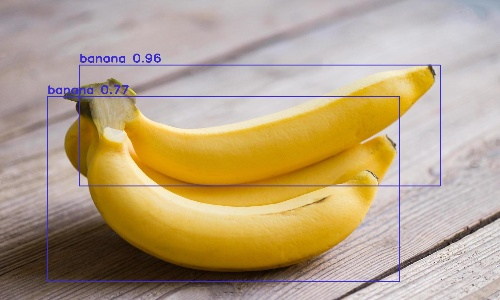

# Object detection using deep learning with OpenCV and Python 

OpenCV `dnn` module supports running inference on pre-trained deep learning models from popular frameworks like Caffe, Torch and TensorFlow. 

When it comes to object detection, popular detection frameworks are
 * YOLO
 * SSD
 * Faster R-CNN
 
 Support for running YOLO/DarkNet has been added to OpenCV dnn module recently. 
 
 ## Dependencies
  * opencv
  * numpy
  
`pip install numpy opencv-python`

**Note: Compatability with Python 2.x is not officially tested.**

 
 
 ### sample output :
 
 
Checkout the object detection implementation available in [cvlib](http:cvlib.net) which enables detecting common objects in the context through a single function call `detect_common_objects()`.
 
 
 (_SSD and Faster R-CNN examples will be added soon_)
